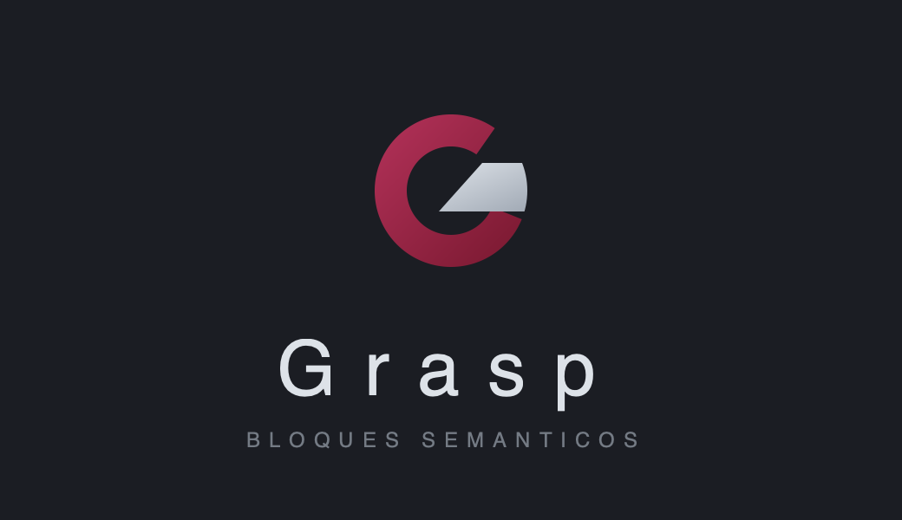

<p align="center">
  
</p>

<p align="center">
  Extensión de navegador que traduce <b>por bloques semánticos</b> para aprender inglés leyendo.
</p>

---

## Qué hace

Los traductores convencionales te dan la frase entera traducida, y los
diccionarios te dan palabras sueltas. Ninguno te enseña **cómo se corresponden**
las dos lenguas.

Grasp parte la frase en unidades con significado propio y las muestra alineadas:

```
You show me      the way      when      I give up.
──────────       ────────     ─────     ──────────
Tú me muestras   el camino    cuando    me rindo.
```

La diferencia está en que `give up` es **un solo bloque** que significa
«rendirse», no «dar» + «arriba». Lo mismo con los modismos (`kick the bucket` →
«estirar la pata»), los verbos compuestos (`have been working` → «he estado
trabajando») y las fusiones que el español resuelve en una palabra (`show me` →
«muéstrame»).

Funciona en cualquier página: documentación técnica, artículos, redes sociales o
los subtítulos de YouTube, que son texto HTML y no parte del vídeo.

## Características

- **Traducción bidireccional automática.** Detecta si el texto está en inglés o
  en español y traduce al otro idioma sin que cambies ningún ajuste.
- **Colores por función gramatical.** Los phrasal verbs, los modismos y los
  sintagmas nominales tienen su propio color, para que la estructura se vea de un
  vistazo.
- **Notas gramaticales** sólo cuando aportan algo que no se deduce del par
  original/traducción.
- **Caché local.** La segunda vez que te cruzas con una frase, el resultado es
  instantáneo y no consume cuota.
- **Control del gasto.** El popup muestra cuántas peticiones has hecho hoy con
  cada modelo.
- **Tu propia API key.** Nada pasa por servidores de terceros. Sin suscripción.

## Requisitos

- Chrome, Brave, Edge u otro navegador basado en Chromium (versión 116 o
  superior)
- [Node.js](https://nodejs.org) 18 o superior
- Una API key gratuita de Gemini

## Instalación

### 1. Consigue tu API key de Gemini

Entra en [Google AI Studio](https://aistudio.google.com/apikey), inicia sesión con
tu cuenta de Google y pulsa **Create API key**. Cópiala; la pegarás en el paso 4.

Es gratuita y no requiere tarjeta. Tiene un límite diario de peticiones que varía
según el modelo.

### 2. Descarga y compila el proyecto

```bash
git clone git@github.com:JSNavas/grasp.git
cd grasp
npm install
npm run build
```

Esto genera la carpeta `dist/`, que es la extensión ya empaquetada.

### 3. Carga la extensión en el navegador

1. Abre `chrome://extensions`
2. Activa el **Modo de desarrollador** (interruptor arriba a la derecha)
3. Pulsa **Cargar descomprimida**
4. Selecciona la carpeta **`dist/`** del proyecto

Verás la tarjeta de Grasp en la lista. Fija el icono en la barra pulsando el
icono del puzle y luego el alfiler junto a Grasp.

### 4. Configura tu API key

Pulsa el icono de Grasp para abrir el popup, pega la API key del paso 1 y pulsa
**Guardar**.

La key se guarda en `chrome.storage.local`, es decir, sólo en tu navegador. No
sale de ahí salvo hacia la API de Google.

### 5. Pruébalo

Abre cualquier página en inglés, pon el cursor sobre una frase y **mantén
pulsado Shift**.

## Uso

| Acción | Cómo |
|---|---|
| Traducir una frase | Cursor encima + mantener **Shift** |
| Cerrar la traducción | **Esc**, o mover el cursor fuera |
| Activar/desactivar Grasp | **Alt+G** |

Las dos formas de invocarlo funcionan: puedes mantener Shift mientras mueves el
ratón, o parar el cursor sobre la palabra y pulsar Shift después.

Mientras el cursor esté sobre el recuadro de la traducción, éste no se cierra y no
se traduce nada de su interior, así puedes leerlo con calma o copiar el texto.

## Configuración

Todo se ajusta desde el popup:

| Ajuste | Para qué sirve |
|---|---|
| **Modelo** | Los `flash-lite` tienen más cuota diaria; `flash` traduce algo mejor |
| **Traducir al hacer hover** | Cambia Shift por Alt o Ctrl, o desactiva el modificador |
| **Peticiones por minuto** | Tope de seguridad para no saturar la API |
| **Retardo del hover** | Cuánto debe estar quieto el cursor antes de consultar |
| **Consumo de hoy** | Peticiones gastadas por modelo |

### Sobre el modificador

Por defecto hay que mantener **Shift**. Puedes desactivarlo para que traduzca con
sólo pasar el ratón, pero ten en cuenta que sobre una página densa —una tabla,
por ejemplo— cada movimiento del cursor genera una petición y la cuota diaria
gratuita se agota en minutos.

## Problemas frecuentes

**El popup dice «CRXJS DEV MODE».** El servidor de desarrollo está corriendo y ha
sobrescrito el build. Párealo y ejecuta `npm run build` otra vez.

**Dejó de traducir de repente.** Si acabas de recargar la extensión, pulsa **F5**
en la pestaña: los content scripts ya inyectados quedan desconectados y necesitan
recargarse.

**«Cuota agotada».** Has llegado al límite diario de ese modelo. Cambia a otro
desde el popup; cada uno tiene su cuota independiente.

**El icono se ve como una «G» gris.** Caché de iconos de Chrome. Quita la
extensión y vuelve a cargarla.

## Documentación

| | |
|---|---|
| [Arquitectura](docs/arquitectura.md) | Cómo encajan las piezas y el flujo de una traducción |
| [Decisiones de diseño](docs/decisiones.md) | Por qué está resuelto así y no de otra forma |
| [Desarrollo](docs/desarrollo.md) | Comandos, depuración y cómo extenderlo |
| [Marca](docs/marca.md) | Construcción del logo y paleta |

## Stack

React 19 · TypeScript · Vite · `@crxjs/vite-plugin` · Manifest V3 ·
`@google/genai` con salida estructurada · Shadow DOM · IndexedDB

## Estado

En desarrollo. Funciona el modo hover, la caché y el control de cuota. Pendiente:

- [ ] Botón flotante para traducir todo lo visible en pantalla
- [ ] Modo dedicado para subtítulos de YouTube
- [ ] Guardar bloques marcados para repasarlos después
- [ ] Purga por antigüedad en IndexedDB

## Licencia

MIT
